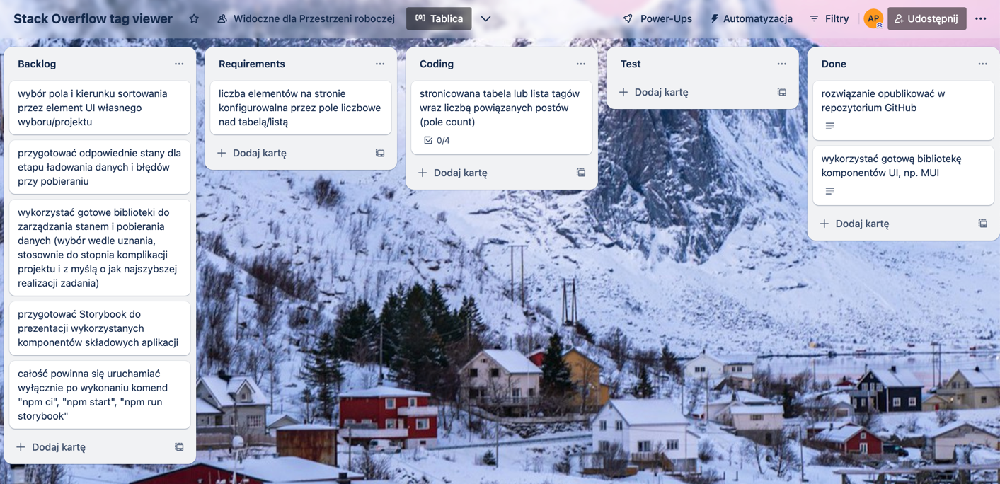

# Stack Overflow tag viewer

This is a project for recruitment purposes, created in a short span of a few days. Although I am aware of what is missing, this state of the application is the outcome of the time constraint. I treated it as a challenge for myself, as I found multiple problems during the development, especially with Storybook, which I was not familiar with previously.

## Development

### Methodology

The project was developed using a Kanban board in Trello. The board is in my native Polish, since I was the sole developer, and the requirements were formulated in this language as well.

The board consisted of 5 columns:

* Backlog — stories to be started, based on the requirements received from the recruiter
* Requirements — the stage where the task went through some brainstorming and visualisation
* Coding — actual programming
* Test — verifying if everything works as expected, including border cases; in this case, also adding Storybook files & tests
* Done — the task is completed

### Technologies

This project was developed using the following technologies:

* React as the main framework
* Redux for state management
* Tailwind CSS + DaisyUI for the user interface components
* Storybook for UI verification and simple tests
* GitHub for version control

## Features

By 'features' I mean the way that the requirements were handled.

### Paginated table
The table is generated from the received data. It displays the tag names and their use count.
Below it, there are two navigation buttons - Previous and Next page, used to change what is currently being displayed.

> Note: The Previous page button does not work on the first page, and the Next page button - on the last one.

On button click, the state (currentPage) is updated. This triggers useEffect, which causes data fetch from the API with the updated page number.

### Adjustable number of displayed elements
In the Filters component, above the table, you can select the number of tags being fetched (20, 50, or 100).

On change on the select field, a listener is fired. It updates the Redux state, causing the useEffect to be triggered.

### Sorting by a parameter & ascending/descending order

The other fields in the Filters component allow you to sort by:
* popularity
* activity
* name

Additionally, you can sort the results in ascending or descending order, based on the tag's `count` property.

Similarly to the number of tags, it works by triggering useEffect and data fetch on change.

### Different states reflected in the UI

Depending on that the API fetch returns, the Tags table component looks differently:
* on loading, when there is no data yet, a spinner is displayed, indicating the need to wait
* on error, data in the table is replaced by a "prompt", specifying the error code, description, and the parameter that was incorrect
* on successful fetch, the table displays a list of tags, according to the filters set

By default, the loading state is set. The fetch function dispatches either a list of tags or an error, along with the message, depending on whether it is successful, and always changes the state. This again works by triggering useEffect and re-rendering the components with the new data.

### Ready libraries utilised for faster development

As mentioned in [Technologies](#technologies), the following ready-to-use libraries are a part of this project:

* Redux - for state management. I decided to use it because I was familiar with it, and I knew it allows for easier prop passing between components. Even if it is a small project, there could be a complicated network of relations, and Redux made it easier.

> Note: there are still local states and props used, however this is mostly due to how I used Storybook.

* TailwindCSS + DaisyUI - the decision to use these in combination comes from the fact, that Tailwind is a highly customizable library, and DaisyUI, based on it, allows to use pre-set components, all in the style of inline CSS. In my opinion, this was simpler and more configurable solution.

### Storybook
I found it to be the hardest part, since I did not use it previously. When I started, I discovered that it is amazingly useful for testing UI components. This experience leads me to believe that all my future projects will use Storybook in some way.

The only problem I could not manage to solve is Storybook/Redux interaction. I used a workaround method, in which props are passed to components anyway, while still being stored in Redux store. Definitely something to work on.

## Questions

### Why is it so simple?
I have not added any additional features, since the current state is exactly what the requirements asked for. This approach leads to:
- avoiding scope creep, by adding more and more features,
- saving time and resources - I did not work on things no-one asked for and are theoretically not necessary or a waste in Lean Management sense

### Why no Router?
You may notice no Router in this app. This is due to the simplicity - the app consists of only one screen.

When would I use a router? Only if the requirements specifically asked for any additional views, such as details on the tags (each tag would be a link leading to a description page).

### Why are there unused Redux actions?
While I used dispatch with explicit content, due to all of them being a single case scenario only, I have left the actions for legacy and to show what else could have been done.

### If it was up to me, what extra features would I add?

* Tags descriptions, as described in [Why no Router?](#why-no-router)
* Specific page select button
* Keyword search
* Additional table columns, for most of the response json keys
* Storybook screens - once I get familiar with it more...

